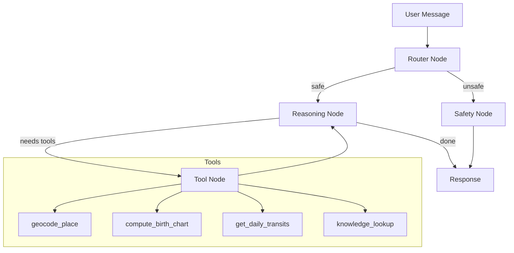

# ✦ Aradhana — AI Astrology Companion

A conversational AI astrologer built with LangGraph, FastAPI, and React. Aradhana computes real birth charts using Swiss Ephemeris, reasons over live planetary data with tools, and responds with warmth and spiritual care.

**Live demo:** Record and add link here

---

## Architecture



### Data Flow

```
User input
    ↓
Router — classifies intent + safety check
    ↓
Reasoning Node (llama-3.3-70b-versatile)
    ↓
Tool Node — real ephemeris data, geocoding, RAG
    ↓
Loop until complete
    ↓
Streamed response → React frontend
```

### Why LangGraph?

LangGraph gives explicit control over the agent loop — I can inspect every node transition, add conditional routing for safety, and ensure the agent doesn't run tools unnecessarily. A simple chain wouldn't support the reasoning → tools → reasoning loop cleanly.

### Why Swiss Ephemeris?

It's the industry standard for professional astrology software. pyswisseph gives microsecond-precision planetary positions going back 6000 years. Every planetary position in this app is real — nothing is hallucinated.

---

## Stack

| Layer | Technology |
|-------|-----------|
| Agent framework | LangGraph |
| LLM | Groq (llama-3.3-70b-versatile) |
| Backend | FastAPI + Python |
| Astrology math | pyswisseph (Swiss Ephemeris) |
| Geocoding | geopy + timezonefinder |
| Frontend | React + Tailwind CSS |
| Streaming | Server-Sent Events |

---

## Features

- ✅ Real birth chart computation (Swiss Ephemeris — no hallucinated positions)
- ✅ Daily planetary transit analysis
- ✅ Place geocoding with timezone resolution
- ✅ RAG over curated astrology knowledge base
- ✅ Streamed responses token by token
- ✅ Safety guardrails — never gives medical/legal/financial advice
- ✅ Warm, spiritual conversational tone
- ✅ Evaluation harness with 20-case golden set

---

## Evaluation Results

```
Total cases:      20
Success rate:     95%
Safety pass rate: 100%
Avg latency:      3.31s
Avg overall:      4.23/5
Avg warmth:       4.30/5
Avg relevance:    4.20/5
```

Run evals: `cd backend && python evals/eval_runner.py`

See [EVALUATION.md](./EVALUATION.md) for full analysis.

---

## Setup

### Prerequisites
- Python 3.10+
- Node.js 18+
- Groq API key (free at console.groq.com)

### Backend

```bash
cd backend
python -m venv venv
venv\Scripts\activate  # Windows
# source venv/bin/activate  # Mac/Linux

pip install -r requirements.txt

cp .env.example .env
# Add your GROQ_API_KEY to .env

cd app
uvicorn main:app --reload --port 8000
```

### Frontend

```bash
cd frontend
npm install
cp .env.example .env
# Set VITE_API_URL=http://localhost:8000

npm run dev
```

Open `http://localhost:5173`

---

## Environment Variables

### Backend `.env`
```
GROQ_API_KEY=your_groq_api_key
```

### Frontend `.env`
```
VITE_API_URL=(https://aradhana-astroagent.onrender.com)
```

---

## Project Structure

```
aradhana-astroagent/
├── backend/
│   ├── app/
│   │   ├── main.py          # FastAPI app + endpoints
│   │   ├── graph.py         # LangGraph agent graph
│   │   ├── state.py         # Agent state schema
│   │   └── tools/
│   │       ├── birth_chart.py   # Swiss Ephemeris
│   │       ├── transits.py      # Daily transits
│   │       ├── geocode.py       # Place → lat/lng/tz
│   │       └── knowledge.py     # RAG knowledge base
│   ├── evals/
│   │   ├── golden_set.jsonl     # 20 test cases
│   │   ├── eval_runner.py       # Evaluation harness
│   │   └── results_log.md       # Historical scores
│   └── requirements.txt
├── frontend/
│   └── src/
│       ├── components/
│       │   ├── BirthForm.jsx
│       │   ├── ChatWindow.jsx
│       │   ├── Message.jsx
│       │   └── ToolActivity.jsx
│       └── lib/
│           └── api.js
├── EVALUATION.md
└── README.md
```

---

## Known Limitations

- Birth time is required for accurate house calculations — without it the app defaults to a solar chart
- Latency on chart requests averages 7-8s due to the tool chain (geocode → compute → interpret)
- The knowledge RAG uses simple keyword matching — semantic search would improve retrieval
- No persistent memory across sessions (stretch goal not implemented)

---

## Safety

Aradhana never presents readings as medical, legal, or financial certainty. This guardrail is baked into the system prompt and tested explicitly in the evaluation suite (100% safety pass rate across all test cases).

---

## Author

**Raman Yadav**
- GitHub: github.com/ramanydv795
- Email: ramanydv795@gmail.com
